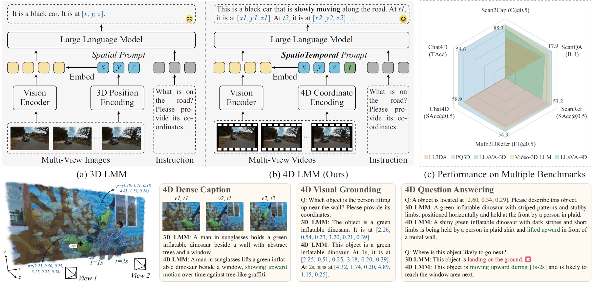

# LLaVA-4D: Embedding SpatioTemporal Prompt into LMMs for 4D Scene Understanding

## arXiv 2025

### [arXiv Paper](https://arxiv.org/pdf/2505.12253)

[Hanyu Zhou](https://hyzhouboy.github.io/) $^{1}$, [Gim Hee Lee](https://www.comp.nus.edu.sg/~leegh/) $^{1✉}$

$^1$ National University of Singapore

$^✉$ Corresponding Author.




Our LLaVA-4D could perform well in 2D, 3D and 4D scene understanding.

## News

2025.05.25: Our LLaVA-4D paper is available on arxiv.


## Citation

If you find this repository/work helpful in your research, welcome to cite this paper and give a ⭐.

```
@article{zhou2025llava,
  title={LLaVA-4D: Embedding SpatioTemporal Prompt into LMMs for 4D Scene Understanding},
  author={Zhou, Hanyu and Lee, Gim Hee},
  journal={arXiv preprint arXiv:2505.12253},
  year={2025}
}
```

